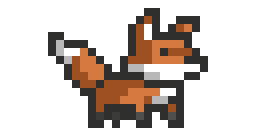

# The Quick Brown Fox

    
    

Yeah... not really sure what this project is yet.

Site should be live here: [https://fox.subparprogramming.org/](https://fox.subparprogramming.org/)

Some technologies we're looking to use:

- [Next.js](https://nextjs.org/)
- [react-spring](https://react-spring.io/)
- [SuperTokens](https://supertokens.com/)
- [TypeScript](https://www.typescriptlang.org/)
- [Tailwind CSS](https://tailwindcss.com/)
- [Godot Engine](https://godotengine.org/)

Fonts:

- [Rampart One](https://fonts.google.com/specimen/Rampart+One)
- [New Tegomin](https://fonts.google.com/specimen/New+Tegomin)
- [Noto Sans Japanese](https://fonts.google.com/noto/specimen/Noto+Sans+JP)
- [Noto Serif Japanese](https://fonts.google.com/noto/specimen/Noto+Serif+JP)
- [Shippori Mincho](https://fonts.google.com/specimen/Shippori+Mincho)

Colors:

-  Space Cadet
-  Independence
-  Heliotrope Gray
-  Isabelline
-  Raw Sienna

Miscellaneous Links:

- [https://cssgradient.io/blog/css-gradient-text/](https://cssgradient.io/blog/css-gradient-text/)
